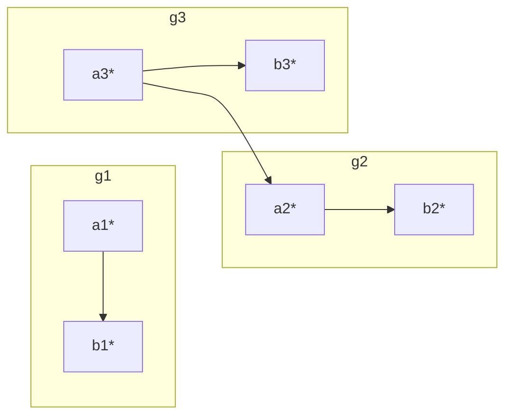

Jekyll的主要功能是将静态文件转换为静态网站。
比如在本地某个空目录下执行```jekyll new myblog```之后，该目录下就会生成构建静态网站的必要文件:


```mermaid
 graph LR  
   subgraph g1  
     a1*-->b1*  
   end  
   subgraph g2  
     a2*-->b2*  
   end  
   subgraph g3  
     a3*-->b3*  
   end  
   a3*-->a2*
```
